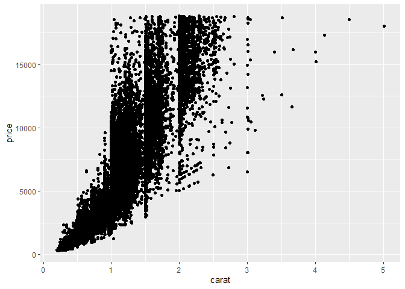
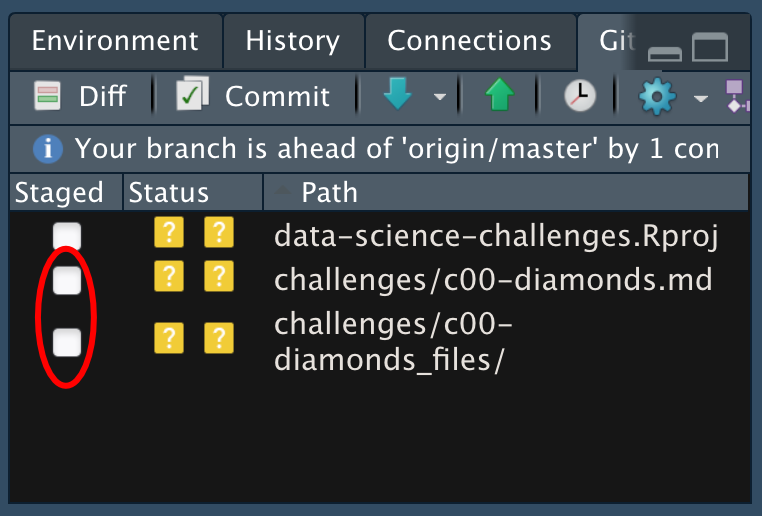

Getting Started: Diamonds
================
(Navya Tiwari)
2020-

- [Grading Rubric](#grading-rubric)
  - [Individual](#individual)
  - [Submission](#submission)
- [Data Exploration](#data-exploration)
  - [**q1** Create a plot of `price` vs `carat` of the `diamonds`
    dataset below. Document your observations from the
    visual.](#q1-create-a-plot-of-price-vs-carat-of-the-diamonds-dataset-below-document-your-observations-from-the-visual)
  - [**q2** Create a visualization showing variables `carat`, `price`,
    and `cut` simultaneously. Experiment with which variable you assign
    to which aesthetic (`x`, `y`, etc.) to find an effective
    visual.](#q2-create-a-visualization-showing-variables-carat-price-and-cut-simultaneously-experiment-with-which-variable-you-assign-to-which-aesthetic-x-y-etc-to-find-an-effective-visual)
- [Communication](#communication)
  - [**q3** *Knit* your document in order to create a
    report.](#q3-knit-your-document-in-order-to-create-a-report)
  - [**q4** *Push* your knitted document to
    GitHub.](#q4-push-your-knitted-document-to-github)
  - [**q5** *Submit* your work to
    Canvas](#q5-submit-your-work-to-canvas)
  - [**q6** *Prepare* to present your team’s
    findings!](#q6-prepare-to-present-your-teams-findings)

*Purpose*: Throughout this course, you’ll complete a large number of
*exercises* and *challenges*. Exercises are meant to introduce content
with easy-to-solve problems, while challenges are meant to make you
think more deeply about and apply the content. The challenges will start
out highly-scaffolded, and become progressively open-ended.

In this challenge, you will go through the process of exploring,
documenting, and sharing an analysis of a dataset. We will use these
skills again and again in each challenge.

*Note*: You will have seen all of these steps in `e-vis00-basics`. This
challenge is *primarily* a practice run of the submission system. The
Data Exploration part should be very simple.

<!-- include-rubric -->

# Grading Rubric

<!-- -------------------------------------------------- -->

Unlike exercises, **challenges will be graded**. The following rubrics
define how you will be graded, both on an individual and team basis.

## Individual

<!-- ------------------------- -->

| Category | Needs Improvement | Satisfactory |
|----|----|----|
| Effort | Some task **q**’s left unattempted | All task **q**’s attempted |
| Observed | Did not document observations, or observations incorrect | Documented correct observations based on analysis |
| Supported | Some observations not clearly supported by analysis | All observations clearly supported by analysis (table, graph, etc.) |
| Assessed | Observations include claims not supported by the data, or reflect a level of certainty not warranted by the data | Observations are appropriately qualified by the quality & relevance of the data and (in)conclusiveness of the support |
| Specified | Uses the phrase “more data are necessary” without clarification | Any statement that “more data are necessary” specifies which *specific* data are needed to answer what *specific* question |
| Code Styled | Violations of the [style guide](https://style.tidyverse.org/) hinder readability | Code sufficiently close to the [style guide](https://style.tidyverse.org/) |

## Submission

<!-- ------------------------- -->

Make sure to commit both the challenge report (`report.md` file) and
supporting files (`report_files/` folder) when you are done! Then submit
a link to Canvas. **Your Challenge submission is not complete without
all files uploaded to GitHub.**

# Data Exploration

<!-- -------------------------------------------------- -->

In this first stage, you will explore the `diamonds` dataset and
document your observations.

### **q1** Create a plot of `price` vs `carat` of the `diamonds` dataset below. Document your observations from the visual.

*Hint*: We learned how to do this in `e-vis00-basics`!

``` r
## TASK: Plot `price` vs `carat` below
## Your code here!
#?diamonds

#summary(diamonds)

ggplot(
  data=diamonds
) +
  geom_point(
    mapping = aes(
      x = carat,
      y = price
    )
  )
```

<!-- -->

**Observations**:

- At first look it seems that when number of carats is lower {in the 0
  to 1 carat region} the price tends to fall in a smaller range. As
  carat increases, the overall price also tends to increase, but the
  range of prices becomes much wider. And so there is a positive
  realtionship between the carat and rpice

- So, carat does influence the price of a diamond, but it is probably
  not the only variable influencing price. At the same carat weight,
  there can be diamonds at very different prices, so it would be
  interesting to look at other variables in the dataset, such as cut,
  color, or clarity, to understand what would explains that variation.

- This could also be an interesting visualization for first time
  customers who aren’t as familiar with diamond terminology. It shows
  that knowing the carat alone does not tell you exactly how much a
  diamond will cost, since diamonds of similar weights can exist across
  a pretty wide price range.

### **q2** Create a visualization showing variables `carat`, `price`, and `cut` simultaneously. Experiment with which variable you assign to which aesthetic (`x`, `y`, etc.) to find an effective visual.

``` r
## TASK: Plot `price`, `carat`, and `cut` below
## Your code here!
ggplot(
  data=diamonds
) +
  geom_point(
    mapping = aes(
      x = carat,
      y = price, 
      color = cut
    )
  )
```

<!-- -->

**Observations**:

- Based on my understanding of the geom_point documentation, x and y
  determine the position of each data point. The carat variable made
  most sense as the so I needed another aesthetic to represent the third
  variable, cut. Since cut has its own categories, I thought it made
  sense to experiment with the different aesthetic settings as asked.

  - Why color was the final choice I landed on:

  - It was easily the most distinctive to the eye, and compared to the
    alternatives, it made the different cut categories easiest to
    distinguish.

  - Alternative approaches to color:

  - alpha was the first variable I tried. It adjusts the transparency of
    the data points, but because there is so much overlap in the graph,
    the differences in transparency didn’t come across as a very
    compelling way to represent cut.

  - I also experimented with fill, shape, size, and stroke, but they
    similarly did not make the different cut categories as easy to
    distinguish as color did.

  - I think if we were allowed to use different functions besides
    aesthetics from geom_point it would be nice to have the 5 cut
    categories as 5 plots side by side. That way a customer might
    understand for a given cut quality what is the price range supposed
    to be like

# Communication

<!-- -------------------------------------------------- -->

In this next stage, you will render your data exploration, push it to
GitHub to share with others, and link your observations within our [Data
Science
Wiki](https://olin-data-science.fandom.com/wiki/Olin_Data_Science_Wiki).

### **q3** *Knit* your document in order to create a report.

You can do this by clicking the “Knit” button at the top of your
document in RStudio.

<figure>

<figcaption aria-hidden="true">Terminal</figcaption>
</figure>

This will create a local `.md` file, and RStudio will automatically open
a preview window so you can view your knitted document.

### **q4** *Push* your knitted document to GitHub.

<figure>

<figcaption aria-hidden="true">Terminal</figcaption>
</figure>

You will need to stage both the `.md` file, as well as the `_files`
folder. Note that the `_files` folder, when staged, will expand to
include all the files under that directory.

<figure>

<figcaption aria-hidden="true">Terminal</figcaption>
</figure>

### **q5** *Submit* your work to Canvas

Navigate to your GitHub repository’s website and find the URL that
corresponds to your report. Submit this to Canvas to complete the
assignment.

### **q6** *Prepare* to present your team’s findings!

If your team is on-deck, you are responsible for putting together a
discussion of the challenge. I’ll demonstrate how to do this by leading
the discussion of Challenge 0.
